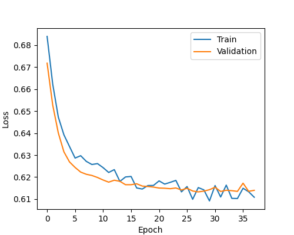
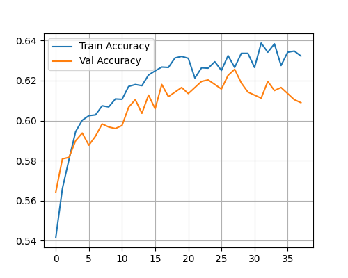
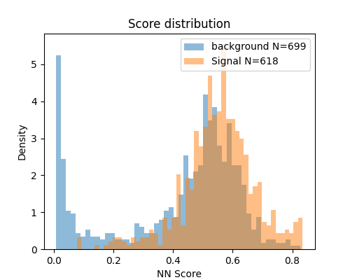
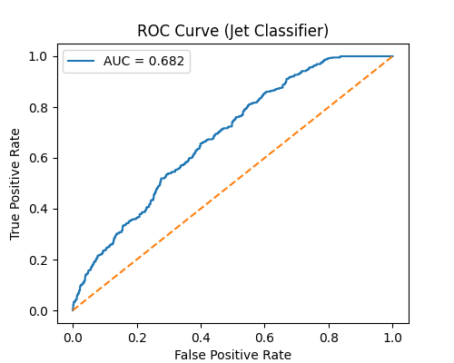
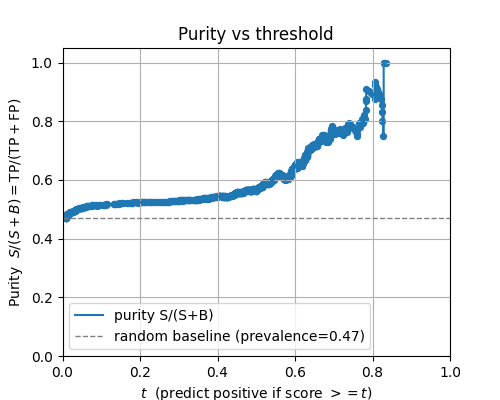
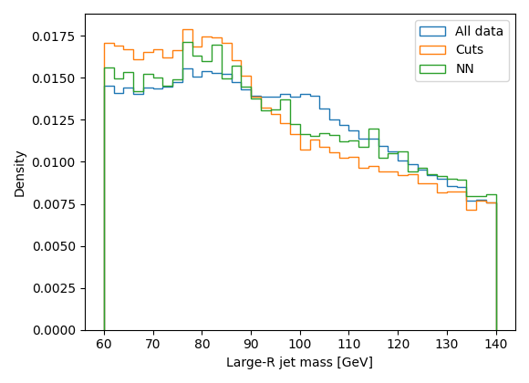
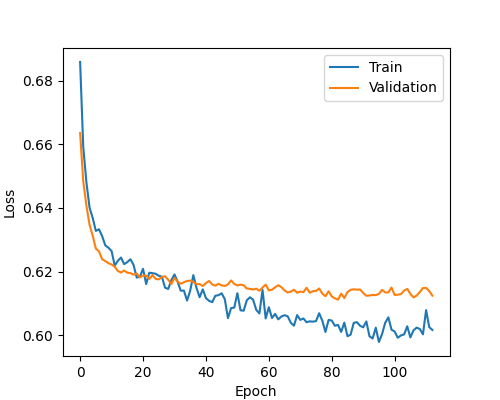

# Neural-Network Tagger for Hadronic V→qq̄ Jets

Welcome! This repo contains my applied ML project for the course FYSN33.  
It contains training of a tiny neural network (NN) which tags boosted **W/Z→qq̄** jets and compares it to a cut-based baseline. The NN is then applied to real ATLAS Open Data.  
Learn more about the data source here: https://opendata.atlas.cern/

---

## What’s in this repo

- `docs/`
  - `assignment.pdf` — the project brief and deliverables.
  - `requirements.txt` — minimal Python deps (numpy, matplotlib, torch, etc.).
- `datasets/`
  - `jets.csv` — **ATLAS Open Data** (flattened; leading lepton + large-R jets).
  - `pythia.csv` — **MC** in the same format plus `v_true` (truth label for large-R jets).
- `eventGenerator.py`:
  - `Particle`/`Event` classes.
  - CSV loading.
- `analysis.py`:
  - Cut-based selection + purity scaffold.
- `NN.py`:
  - Feature building.
  - torch-numpy interface.
  - NN model definition.
  - NN training loop with early stopping.
  - NN selection (cf. cut-based selection).
  - Long list of helper functions for evaluation.
- `main.py`:
  - Initialization and analysis outlined in `assignment.pdf`.
  - Particularly a comparison between NN selection and cut-based selection.
- `results/`:
  - complete output files (.png and .md) for patience=10 run
  - selected output files for patience=30 run
- `extras/` *(for future development)*:
  - `main213.cc` — PYTHIA generator used to produce `pythia.csv`.  
  - `skimevents.py` — ROOT→CSV skimmer for the open data format.

---

## Quick commands
In the `neural-network-tagger-for-lhc` directory:

```bash
# create & activate a virtual env
python -m venv .venv
source .venv/bin/activate  # Windows: .venv\Scripts\activate

# install dependencies
pip install -r ./docs/requirements.txt

# run the analysis
python main.py 
```

---

## Neural network (`NN.py`) - Documentation and Results

### 1. Feature engineering

#### Input representation

Each event is mapped to a 10-dimensional feature vector
$$
x_i \in \mathbb{R}^{10}
$$
constructed from the leading (large-R) jet and leading lepton:
$$
x_i = (p_T^j,\: \eta^j,\: \phi^j,\: p_T^\ell,\: \eta^\ell,\: \phi^\ell,\: \Delta\phi(j,\ell),\: \\\qquad\qquad\qquad\Delta R(j,\ell),\:p_T^j/p_T^\ell,\: (p_T^j-p_T^\ell)/(p_T^j{+}p_T^\ell))_i.
$$
(see ```eventGenerator.py```)

- No jet mass or energy is included
- This avoids mass sculpting in final spectrum

The feature construction is implemented in:
```bash
NN.py → class FeatureBuilder → build_feature()
```

### 2. Dataset Construction
A dataset, $X$, containing feature vectors for each event in a given .csv file is constructed in

```bash
NN.py → class FeatureBuilder → build_dataset()
```
which does
```bash
X = []
for e in events do: X <- build_feature(e)
```

The MC dataset (used for training and validation) is split **by event ID** (80/20) into:
- Training set
- Validation set

Feature building for the MC dataset includes constructing a truth vector $y_i\in\{0,1\}^N$, where $N$ is the number of events.

Training events are **shuffled** to avoid overtraining on correlated objects. This is implemented in
```bash
NN.py → split_by_id()
```

Feature standardization is performed with respect to the training set:
$$
X_{\text{std}} = \frac{X-\mu_{\text{train}}}{\sigma_{\text{train}}},
$$
to stabilize training.


### 3. Model Architecture

Architecture:
- Linear(10,32)
- ReLU
- Dropout(p=0.1)
- Linear(32,16)
- ReLU
- Linear(16,1)

The ouput is a logit, $z \in(-\infty,\infty)$, converted to a probability using a sigmoid:
$$
p = \sigma(z) = \frac{1}{1+e^{-z}}.
$$
Loss function:
- `BCEWithLogitsLoss`

Optimizer:
- `AdamW`, lr = 1e-3.

Early stopping is applied based on validation loss (patience = 10). Early stopping is implemented under *"validate"* in the training loop:
```bash
NN.py → class Trainer → train()
```

### 4. Training Behavior
Training stops after 38 epochs (patience = 10).

Final validation performance:
- AUC $\approx$ 0.68
- Validation accuracy $\approx$ 0.61

Loss and accuracy evolution are shown in Figure (1) and (2). For larger patience values, (pat $\geq 20$), validation loss converged before training loss, indicating onset of overfitting. 


<figure>
    
    <figcaption> Figure 1: Training and validation loss as a function of epoch. The loss corresponds to binary cross entropy with logits. Early stopping prevents overfitting by halting training when the validation loss no longer improves. The absence of a strong divergence between training and validation loss indicates limited overtraining. An example of overtraining can be seen in Appendix A. </figcaption>
</figure>

<figure>
    
    <figcaption>Figure 2: Training and validation accuracy as a function of epoch. Accuracy is defined as the fraction of correctly classified events to total events, assigning events with probability larger than 0.5 as signal. The plateauing of the accuracy curves indicate that the model generalizes to data outside the training set. The absence of divergence between training and validation accuracy suggests limited overfitting. </figcaption>
</figure>


### 5. Classifier Performance
The classifier performance is evaluated on the independent validation dataset. The distribution of NN scores for signal and background events is shown in Fig. (3). The score corresponds to the sigmoid output of the network and can be interpreted as the predicted probability of an event being signal.

The separation between the two distributions demonstrates that the NN discriminates between signal and background, though significant overlap remains, consistent with an AUC of approximately 0.68 (Fig. (4)).

<figure>
    
    <figcaption>Figure 3: Distribution of neural network scores for signal (orange) and background (blue) events in the validation dataset. The histograms are normalized to unit area (density=True).</figcaption>
</figure>

The receiver operating characteristic (ROC) curve is shown in Fig. (4). The curve shows the true positive rate (signal efficiency) versus the false positive rate (background efficiency).

<figure>
    
    <figcaption>Figure 4: Receiver operating characteristic (ROC) curve for the NN evaluated on the validation dataset. The area under the curve (AUC) quantifies the discriminating power of the classifier. </figcaption>
</figure>

The AUC value of approximately 0.68 indicates moderate separation between signal and background. An AUC above 0.5 indicates better performance than random guessing, while values closer to 1 would correspond to near-perfect separation between signal and background.


The signal purity $P = S/(S+B)$ as a function of the NN score threshold is shown in Fig. (5).
<figure>
    
    <figcaption>Figure 5: Signal purity P = S/(S+B) as a function of the threshold applied to the NN score. The dashed horizontal line indicates the class prevalence defined as the expected purity for random scores (baseline). </figcaption>
</figure>


### 6. Working Point Selection
A working point threshold, $t^*$, is chosen by 
- scanning threshold on the NN score
- Maximizing purity $S/(S+B)$, subject to $\epsilon_S\geq0.3$.

Working point selection is implemented in
```bash
NN.py → find_working_point()
```

This gives:
- $t^* = 0.6064$
- Purity, $P(t^*) \approx$ 0.66
- Signal efficiency, $\epsilon_S\approx 0.31$
- Background efficiency, $\epsilon_B\approx 0.13$

cf. Fig. 5.

### 7. Comparison to Cut-Based Selection

| **Selection** | **Purity** | $\boldsymbol{\epsilon_S}$ | $\boldsymbol{\epsilon_B}$ |
|---|---|---|---|
| Baseline (no cuts) | 0.476 | n/a | n/a |
| Cut-based | 0.526 | 0.553 | 0.454 |
|Neural Network | 0.688 | 0.309 | 0.128 |

For more detailed results, see terminal output corresponding to all results reported in this section, under `results/out.md`.


### 8. Application to ATLAS Open Data
The trained NN is applied to real ATLAS data using the fixed working point $t^*$.

The resulting mass spectrum is shown in Fig. (6). The NN selection enhances the signal to noise ratio below 80 GeV mass and shows a mass peak around 80 GeV, consistent with hadronic W/Z decays. The overall performance is not necessarily better than the cut-based selection, especially for reducing noise beyond 80 GeV (green vs orange curves), but clearly discriminates W/Z signal ($m_{W/Z}\approx 80$ GeV) from the bare data (blue). Importantly, the mass and energy variables were not included in the feature vector to avoid mass sculpting.


<figure>
    
  <figcaption>
    Figure 6: Large-R jet mass spectrum for ATLAS Open Data before selection (All data), after the cut-based selection (Cuts), and after the neural-network selection (NN). All histograms are normalized to unit area. The NN selection enhances the signal to noise ratio below 80 GeV mass and clearly shows the W/Z GeV mass peak at around 80 GeV.   
  </figcaption>
  
</figure>


---

## Appendix A

An example training and validation loss-curve for patience = 30 (113 epochs) is shown in Fig. (7). Note the divergence between training and validation loss, indicating onset of overfitting beyond approximateley 40 epochs.


<figure>
    
  <figcaption>
    Figure 7: Training and validation loss as a function of epoch number for patience = 30 (113 epochs).  
  </figcaption>
  
</figure>


The mass spectrum for the same NN is shown in Fig. (8).

<figure>
    
  <figcaption>
    Figure 8: Mass spectrum for ATLAS Open Data, for patience = 30 (113 epochs).
  </figcaption>
  
</figure>

